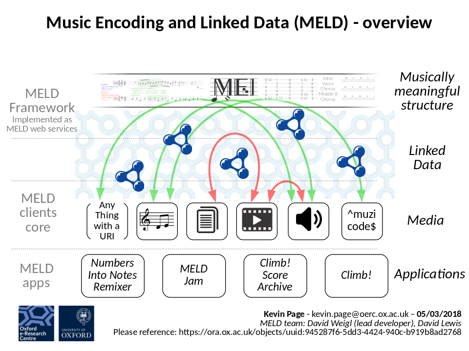

MELD: Music Encoding and Linked Data
====================================

An introduction to MELD can be found on the [MELD website](https://meld.web.ox.ac.uk)

The MELD implementation is split across a number of different repositories:

* [oerc-music/meld-web-services](https://github.com/oerc-music/meld-web-services), a reference implementation of the session and annotation services providing a server-side implementation of the MELD framework.
* [oerc-music/meld-clients-core](https://github.com/oerc-music/meld-clients-core), a React.js library providing functionalities common to MELD applications, including reusable web page elements, graph traversal actions, rendering and interaction handlers, and state reducers.
* Repositories for several MELD apps.





MELD Web Services
-----------------
Starting from MELD 2.0, we recommend the use of Solid Pods for managing sessions and storing annotations. Any Solid Pod provider should be compatible with MELD; the MELD team recommend [node-solid-server](https://github.com/solid/node-solid-server) for local deployments. See [music-scholars-annotator](https://trompamusic.github.io/music-scholars-annotator/) for an example MELD app which uses Solid Pods.

Apps conceived prior to MELD 2.0 may still be using a bespoke partial implementation of LDP provided directly by meld-web-services. This reference implementation of the MELD 1.0 annotation and session web services is available at [oerc-music/meld-web-services](https://github.com/oerc-music/meld-web-services). To install: 

```
git clone git@github.com:oerc-music/meld-web-services
cd meld-web-services
pip install -r requirements.txt #(or use a virtualenv)
source set_env.sh 
python manage.py runserver #(default port: 5000)
```

This code depends on a number of Python modules, including Flask (web server), and PyLD, rdflib, and SPARQLWrapper (Linked Data functionalities around RDF graph handling, JSON-LD conversion, and SPARQL querying). A full listing of the dependencies is available in the requirements.txt file.


MELD Clients Core
-----------------
A React.js library providing common MELD web page elements, graph traversal actions, rendering and interaction handlers, and state reducers. To include this in your MELD app, add the following entry to the dependencies in your application's package.json file:

```
"meld-clients-core": "oerc-music/meld-clients-core"
```

MELD Clients Core depends on a number of npm modules, including React, Redux, and Redux-Thunk (web application framework), Axios (HTTP communication), and "jsonld" and "n3" (Linked Data functionalities around RDF graph handling and JSON-LD conversion). A full list of dependencies is available in the package.json file.

MELD Clients Core also includes JavaScript components of [Verovio](http://www.verovio.org), a music engraving library developed by the Swiss RISM office (see [rism-ch/verovio](http://github.com/rism-ch/verovio) repository).

MELD Apps
---------
We maintain [a list of current MELD app repositories]( https://github.com/oerc-music/meld-clients-core/blob/master/meld-applications.md). Further description of specific MELD apps can be found on the [MELD Apps and Projects page](https://meld.web.ox.ac.uk/apps). In other cases MELD apps are sometimes under development in private repositories.


For a detailed description, please refer to our ISMIR 2017 paper: https://ora.ox.ac.uk/objects/uuid:945287f6-5dd3-4424-940c-b919b8ad2768
